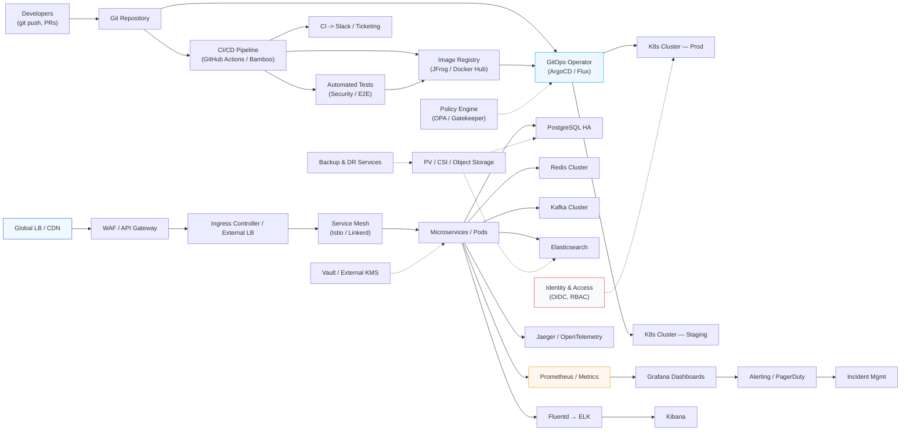

<!-- ===================== HERO SECTION ===================== -->

  

  
  
  

 

<!-- ===================== ABOUT ===================== -->

## 👨‍💻 About Me

I design and engineer **production-grade infrastructure platforms**.

My focus is building:

🚀 Distributed systems & cloud-native infrastructure  
☸️ Kubernetes platform engineering  
⚙️ DevOps automation & GitOps workflows  
🔐 Secure, scalable and reliable environments  

**Open to relocate to EU**

 

<!-- ===================== PROFESSIONAL SUMMARY ===================== -->

## 🧾 Professional Summary

DevOps Engineer and Solution Architect with **6+ years of experience** designing, implementing, and operating scalable infrastructure platforms and cloud-native environments. Experienced in Kubernetes platform engineering, CI/CD automation, GitOps workflows, observability, Linux infrastructure, and enterprise production systems. Proven track record improving scalability, automation, and operational efficiency; currently expanding expertise in AI infrastructure, LLM-based systems, and AI-assisted DevOps automation.

 

<!-- ===================== ENGINEERING FOCUS ===================== -->

## 🏗️ Engineering Focus

| ☸️ Kubernetes | ⚙️ Automation | 🔐 Security |
|---|---|---|
| Cluster architecture | Infrastructure as Code | CI/CD pipelines |
| Container orchestration | GitOps workflows | Security hardening |
| Service mesh | DevOps automation | Access control |

 

<!-- ===================== SYSTEM ARCHITECTURE ===================== -->

## 🧠 System Architecture

A simplified, modern architecture view: developers push changes to Git, CI builds and pushes images to a registry, GitOps reconciles the desired state into the Kubernetes platform which houses API gateway/ingress, service mesh, and microservices. Stateful systems (Postgres HA, Redis, Kafka, Elasticsearch) are attached as well as a centralized observability stack that feeds alerting and incident management.

 

<!-- ===================== FEATURED PROJECTS ===================== -->

## 🚀 Featured Projects

### ⭐ DevOps Automation Toolkit
Infrastructure automation collection:
- Linux server bootstrap
- SSH hardening & security automation
- Kubernetes utilities
- Operational scripts
- Deployment helpers

### ☸️ Kubernetes Platform Engineering
Hands-on infrastructure:
- Kubernetes cluster deployment
- Ingress architecture
- Monitoring stack
- Container lifecycle management
- Production operations

### 🌐 API Gateway & Cloud Networking
Built and managed:
- API gateway architecture
- Service routing & traffic management
- Secure exposure patterns
- High availability design

### 🗄️ Database Reliability
Experience with:
- PostgreSQL high availability
- Replication & backup strategies
- Database operations
- Data integrity

### 📡 Distributed Infrastructure
Implemented:
- Kafka messaging platforms
- Elasticsearch clusters
- Observability pipelines
- Scalable backend services

### 💼 Multi-Project Production Platform
nahalgsht.com | visaland.org | panafor.com | aia.tools
- Designed and implemented production infrastructure for multiple web platforms
- Built centralized monitoring using Prometheus, Grafana, and Uptime Kuma
- Created GitHub Actions CI/CD workflows and GitOps-based deployment processes
- Automated deployments, monitoring, health checks, and operational workflows
- Implemented secure VPN-over-DNS networking solution

 

<!-- ===================== PROFESSIONAL EXPERIENCE ===================== -->

## 💼 Professional Experience

### DevOps Engineer — Sabaidea Corporation (May 2025 - Feb 2026)
- Built and maintained Kubernetes-based production platforms using Kubernetes, Rancher, and Docker
- Designed platform architecture for scalable microservices including API Gateway, ingress, networking, and service discovery
- Implemented CI/CD automation using Bamboo, Bitbucket, and JFrog Artifactory
- Built monitoring and observability solutions using Prometheus, Grafana, and ELK Stack
- Integrated enterprise on-premise projects: Snappfood, Tejarat Bank, Taline, MTN Irancell, MCI
- **Delivered infrastructure supporting millions of daily API requests**
- **Reduced downtime by ~40% and improved incident detection time by ~60%** through monitoring and automation

### Lead DevOps Engineer — Tecnotree Corporation (Sep 2023 - Apr 2025)
- Led DevOps delivery and optimization for telecom platforms: CLM, CBS, HCBS, EIA
- Managed delivery lifecycle for 60+ enterprise telecom projects
- Improved deployment workflows using Kubernetes, Ansible, Git, and TeamCity
- Collaborated with development, architecture, business, and operations teams
- Supported go-live operations, incident response, and reliability improvements
- Worked with PostgreSQL, MySQL, Oracle Database, and Cassandra environments
- Mentored engineers and improved DevOps practices across teams

### Linux Administrator — Tecnotree / Parspack (Nov 2021 - Aug 2023)
- Managed Linux infrastructure: Ubuntu, RHEL, CentOS, AlmaLinux, Rocky Linux
- Installed and maintained Nginx, Apache, MySQL, PHP, DNS, SSH, and FTP services
- Resolved networking and infrastructure issues: DNS, DHCP, VPN, TCP/IP, SSH tunneling
- Supported cloud hosting, CDN, and enterprise infrastructure environments

 

<!-- ===================== TECH STACK ===================== -->

## ⚙️ Technology Stack

### Platform Engineering & DevOps

  

Kubernetes • Rancher • Docker • Terraform • Ansible • GitHub Actions • GitLab CI • Bamboo • Bitbucket • Jenkins • JFrog Artifactory

### Cloud & Infrastructure

  

AWS • GCP • Git • GitHub • Networking • VPN • Security

### Observability & Monitoring

  

Prometheus • Grafana • ELK Stack • Zabbix • Uptime Kuma

### Data Platforms
- PostgreSQL (HA & Replication)
- MySQL
- Redis
- Kafka
- Elasticsearch
- Cassandra
- CockroachDB
- Oracle Database

### AI & MLOps
- RAG Applications
- LLM Integration & AI Agents
- Vector Search
- AI-Assisted DevOps Automation
- MLOps Fundamentals

 

<!-- ===================== ENGINEERING PRINCIPLES ===================== -->

## 🔥 Engineering Principles

| Principle | Focus |
|-----------|-------|
| ⚡ Automation over repetition | Reduce manual work |
| 📋 Infrastructure as Code | Version control everything |
| 🔐 Security by default | Security from day one |
| 📊 Observability everywhere | Visibility and monitoring |
| 💪 Design for failure | Resilience first |
| 📈 Reliable systems at scale | Production ready |

 

<!-- ===================== EDUCATION ===================== -->

## 🎓 Education

- **Master of Computer & Information Sciences** — Azad University
- **Bachelor of Physics** — Kharazmi University

 

<!-- ===================== CERTIFICATIONS ===================== -->

## 🏅 Certifications

- LPIC-1, LPIC-2
- DevOps Foundations
- Kubernetes Monitoring with Prometheus
- Grafana Application Performance Monitoring
- CEH (Certified Ethical Hacker)
- PWK (Penetration Testing with Kali Linux)

 

<!-- ===================== LANGUAGES ===================== -->

## 🗣️ Languages

- **English** — Advanced
- **Persian** — Native
- **Italian** — Intermediate

 

<!-- ===================== GITHUB ACTIVITY ===================== -->

## 📊 GitHub Activity

  

 

<!-- ===================== CONNECT ===================== -->

## 🌐 Connect With Me

  
  

  

